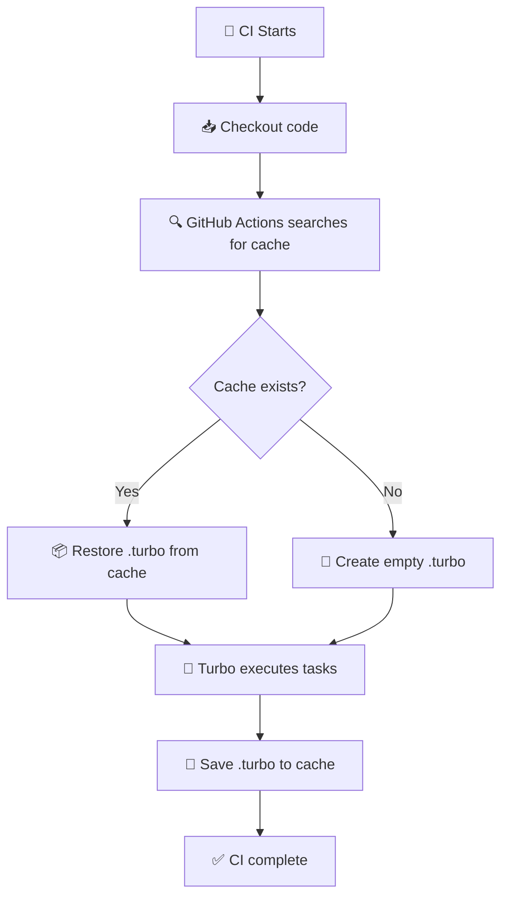
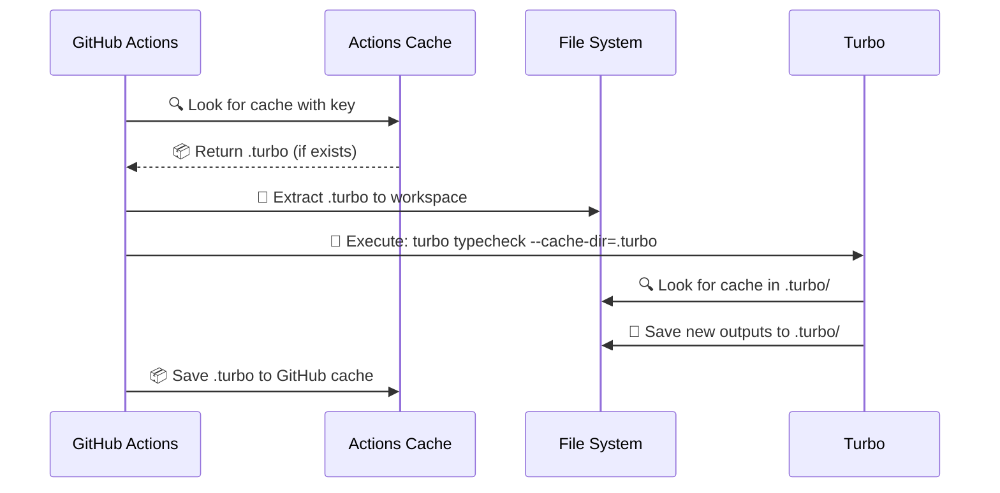
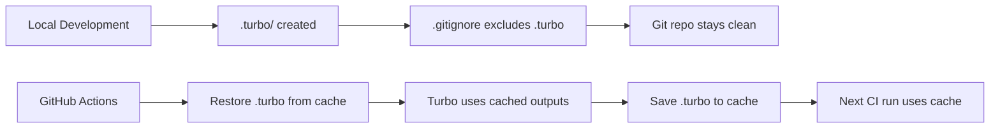

# PNPM Install Action Composite

This composite action optimizes both pnpm and Turbo caches to significantly accelerate GitHub Actions workflows.

## ⚡ Performance

- **First run**: ~3-5 minutes (full download + typecheck)
- **Subsequent runs with cache hit**: ~30-60 seconds (pnpm cache + typecheck cache)
- **Biome (formatting/linting)**: Always fast (~5-10 seconds - no cache needed)
- **Typecheck with Turbo cache hit**: Tasks are skipped entirely when no TS changes

## 🎯 Benefits

- **Smart pnpm cache**: Uses `pnpm-lock.yaml` hash for precise dependency caching
- **Turbo cache for typecheck**: Skips typecheck when no TypeScript changes detected
- **Fast Biome**: Runs directly without cache (already super fast)
- **Cache rotation**: Monthly cache renewal to prevent corruption
- **Offline installation**: Prefers packages from cache when available
- **Husky disabled**: Avoids unnecessary hooks in CI

## 🔧 How it works

### Cache Flow in GitHub Actions



### Cache Strategy Overview



### PNPM Cache
1. **Store cache**: Caches the pnpm store path directory
2. **Cache key**: Combines `OS-pnpm-store-cache-YYYYMM-hash(pnpm-lock.yaml)`
3. **Fallback**: If exact cache not found, uses cache from same month

### Turbo Cache (TypeScript only)
1. **Typecheck cache**: Caches TypeScript compilation outputs
2. **Hash-based**: Uses TS/TSX file content hashing to detect changes
3. **Incremental**: Only runs typecheck when TypeScript files change
4. **Skips entirely**: When no TS changes detected

### Biome (No cache needed)
1. **Direct execution**: Runs `pnpm format-and-lint:check:all` directly
2. **Super fast**: Biome is already optimized, no cache needed
3. **Consistent**: Always runs but completes in seconds

## 📝 Basic Usage

```yaml
steps:
  - uses: actions/checkout@v3
    with:
      fetch-depth: 2  # For Turbo change detection
  
  - uses: actions/setup-node@v3
    with:
      node-version: 20.x

  - name: 📥 Monorepo install
    uses: ./.github/actions/pnpm-install

  - name: 🔍 Check formatting and linting (Biome)
    run: pnpm format-and-lint:check:all

  - name: 🔧 Type checking (Turbo)
    run: pnpm turbo typecheck --cache-dir=.turbo
```

## ⚙️ Advanced Configuration

```yaml
- name: 📥 Monorepo install
  uses: ./.github/actions/pnpm-install
  with:
    enable-corepack: false # Default: false
    cwd: ./packages/web   # Default: '.'
```

## 🐛 Debug and Test

```bash
# Test pnpm cache locally
./.github/actions/pnpm-install/test-cache.sh

# Test Turbo typecheck cache locally
./.github/actions/pnpm-install/test-turbo-cache.sh

# Debug cache information
./.github/actions/pnpm-install/debug-cache.sh

# Verify cache setup
./.github/actions/pnpm-install/verify-cache.sh
```

## 📊 Monitoring

### PNPM Cache
To verify pnpm cache is working:
1. Go to Actions → Workflow run
2. Open step "Setup pnpm cache"  
3. Look for "Cache restored from key: ..."

### Turbo Cache (TypeCheck)
To verify Turbo cache is working:
1. Look for `FULL TURBO` in typecheck output (cache hit)
2. Look for `MISS` in typecheck output (cache miss)
3. Check typecheck execution time

### Biome
Biome always runs but should complete in ~5-10 seconds regardless.

## 🔄 Cache Rotation

### PNPM Cache
- Cache is automatically renewed monthly
- Prevents file corruption and compatibility issues

### Turbo Cache
- Cache is invalidated when TypeScript file contents change
- Uses content-based hashing for precision

## 🚨 Troubleshooting

### PNPM Cache not working
- Check if `pnpm-lock.yaml` has been modified
- Cache is renewed monthly (normal behavior)

### Turbo Cache not working
- Ensure `fetch-depth: 2` is set in checkout action
- Check if TypeScript files have been modified
- Verify `turbo.json` configuration

### Installation still slow
- First installation of the month will be slow (normal)
- First run after TS changes will rebuild typecheck
- Verify you're using `--prefer-offline` and `--cache-dir=.turbo`

### Permission error
```bash
chmod +x .github/actions/pnpm-install/*.sh
```

## 💡 Why .turbo is not committed



**Why this is correct:**
- ✅ `.turbo` in `.gitignore` (doesn't pollute repository)
- ✅ GitHub Actions caches `.turbo` (persists between runs)
- ✅ Turbo uses `--cache-dir=.turbo` (finds the cache)
- ✅ Cache persists between CI runs without cluttering git history

## 💡 Optimization Strategy

- **Biome**: No cache needed - already optimized and fast
- **TypeCheck**: Cached with Turbo - only runs when TS files change
- **Dependencies**: Cached with pnpm - only downloads when lockfile changes 